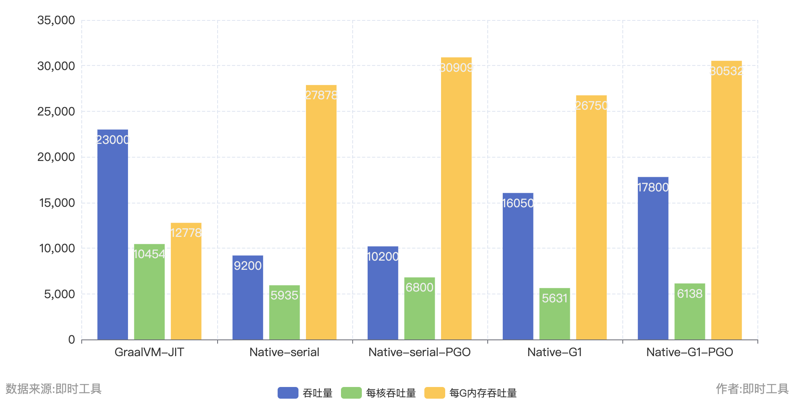
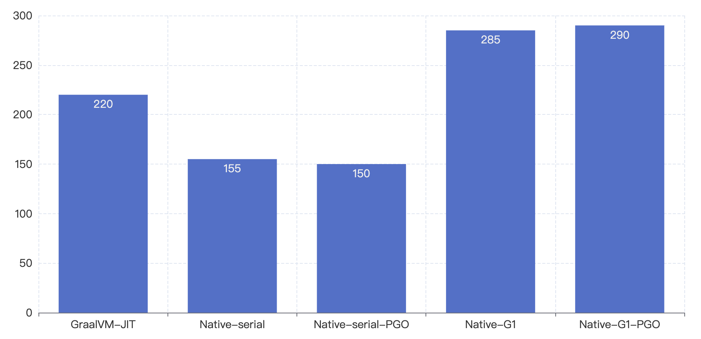
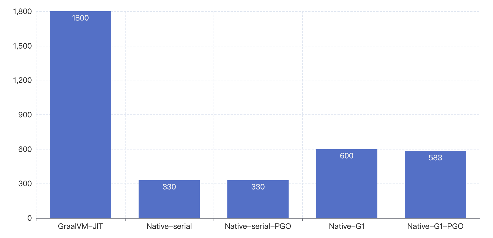
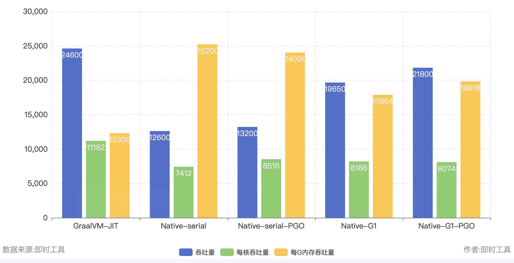
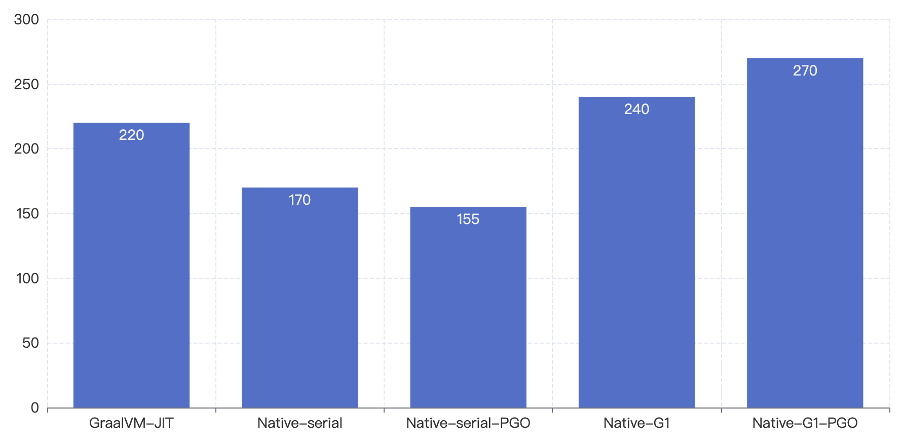
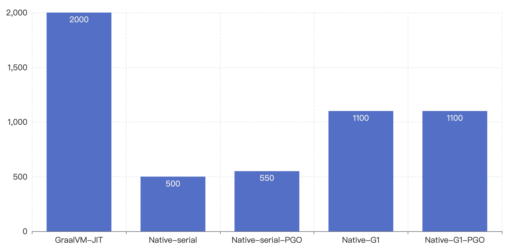
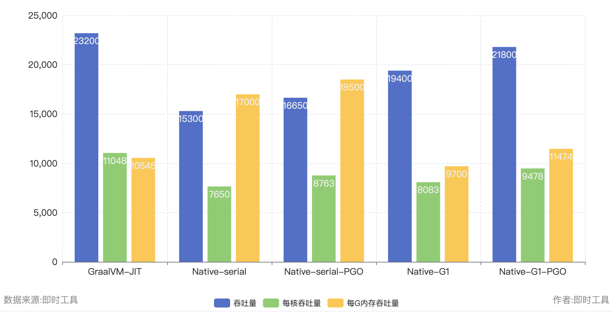
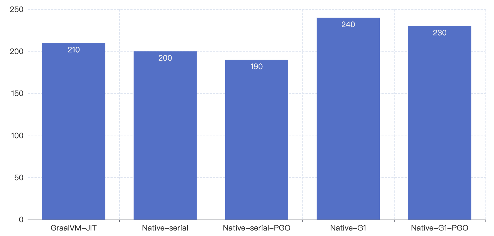
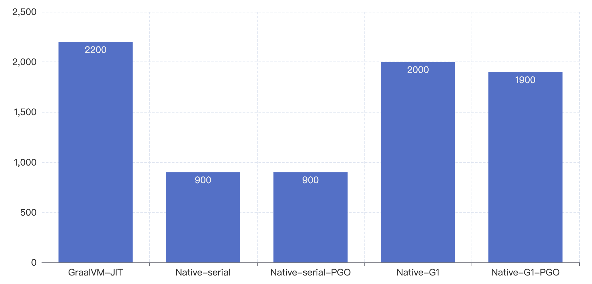

# [loom-benchmark](../loom-benchmark)

## 测试机器配置

CPU: 4核 i9 9900K 3.6~4.7GHZ

## 简单总结

- AOT能带来极快的启动速度。
- PGO可能带来不错的提升。
- JIT能够提供更高的吞吐量，但是内存占用较高。
- 经过PGO优化的G1收集器下，吞吐量和CPU利用效率弱于JIT，但是内存使用率大幅降低。
- 使用串行GC的Native-Image吞吐量表现较差，但内存利用效率是最高的。
- 盲目增加堆内存大小除了浪费内存之外并不能带来明显的性能提升，对内存的分配最好结合压测数据调整。

**综上：**

- 对启动速度和内存占用不敏感的应用程序而言，JIT是最好的选择。吞吐量高、CPU利用率是最高的，但是内存占用也很高。
- 对内存利用率敏感的程序而言，开启了G1的原生镜像会是更好的选择。吞吐量和CPU利用率稍逊JIT，但能节省大量的内存。
- 如果是对服务性能不敏感的程序，可以选择基于串行GC的原生镜像。

## 测试成绩

### 限制最大堆内存500m

| Metric/Runtime        | GraalVM-JIT | Native-serial | Native-serial-PGO | Native-G1 | Native-G1-PGO |
|-----------------------|-------------|---------------|-------------------|-----------|---------------|
| Peak throughput       | 23000       | 9200          | 10200             | 16050     | 17800         |
| Cpu Usage             | 220         | 155           | 150               | 285       | 290           |
| Throughput per cpu    | 10454       | 5935          | 6800              | 5631      | 6138          |
| Memory Usage(max RSS) | 1800        | 330           | 330               | 600       | 583           |
| Throughput per memory | 12778       | 27878         | 30909             | 26750     | 30532         |

吞吐量（越大越好）

CPU使用率（越低越好）

内存占用（越低越好）

### 限制最大堆内存1000m

| Metric/Runtime        | GraalVM-JIT | Native-serial | Native-serial-PGO | Native-G1 | Native-G1-PGO |
|-----------------------|-------------|---------------|-------------------|-----------|---------------|
| Peak throughput       | 24600       | 12600         | 13200             | 19650     | 21800         |
| Cpu Usage             | 220         | 170           | 155               | 240       | 270           |
| Throughput per cpu    | 11182       | 7412          | 8516              | 8188      | 8074          |
| Memory Usage(max RSS) | 2000        | 500           | 550               | 1100      | 1100          |
| Throughput per memory | 12300       | 25200         | 24000             | 17864     | 19818         |

吞吐量（越大越好）

CPU使用率（越低越好）

内存占用（越低越好）

### 限制最大堆内存2000m

| Metric/Runtime        | GraalVM-JIT | Native-serial | Native-serial-PGO | Native-G1 | Native-G1-PGO |
|-----------------------|-------------|---------------|-------------------|-----------|---------------|
| Peak throughput       | 23200       | 15300         | 16650             | 19400     | 21800         |
| Cpu Usage             | 210         | 200           | 190               | 240       | 230           |
| Throughput per cpu    | 11048       | 7650          | 8763              | 8083      | 9478          |
| Memory Usage(max RSS) | 2200        | 900           | 900               | 2000      | 1900          |
| Throughput per memory | 10545       | 17000         | 18500             | 9700      | 11474         |

吞吐量（越大越好）

CPU使用率（越低越好）

内存占用（越低越好）

