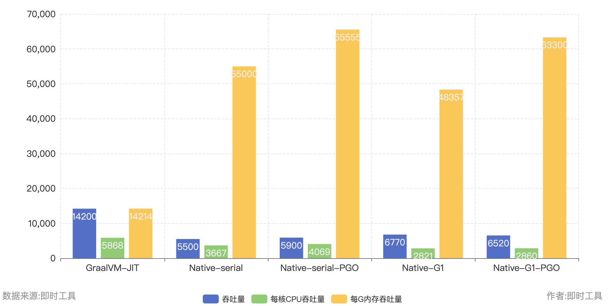
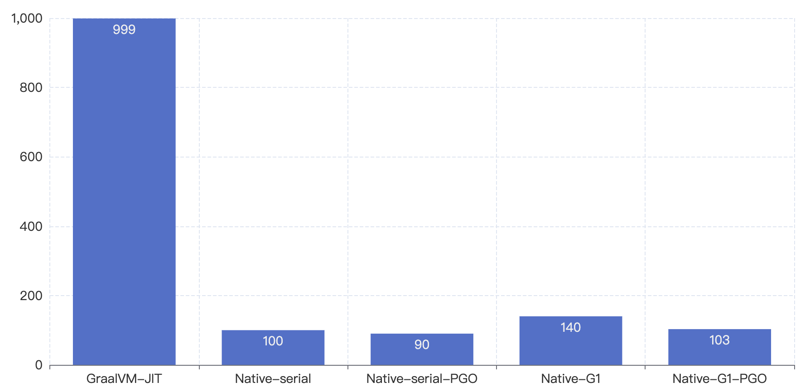

# [loom-benchmark](../loom-benchmark)

## 测试机器配置

CPU: 4核 i9 9900K 3.6~4.7GHZ

## 测试用例

1. 使用vertx-web时限HTTP服务，接收POST请求并交给虚拟线程异步处理。
2. 使用Jackson反序列化请求body。
3. 向虚拟线程池提交10个异步任务，任务内部随机sleep50~100毫秒模拟IO阻塞操作。
4. 重新序列化body并返回给客户端。

## 简单总结

- AOT能带来极快的启动速度。
- PGO可以带来不错的提升。
- JIT能够提供更高的吞吐量，但是内存占用较高。
- 经过PGO优化的G1收集器下，吞吐量和CPU利用效率略弱于JIT，但是内存使用率大幅降低。
- 使用串行GC的Native-Image吞吐量表现较差，但内存利用效率是最高的。
- 盲目增加堆内存大小除了浪费内存之外并不能带来明显的性能提升，堆内存的分配最好结合压测数据调整。

**综上：**

- 对启动速度和内存占用不敏感的应用程序而言，JIT是最好的选择。吞吐量高、CPU利用率是最高的，但是内存占用也很高。
- 对内存利用率敏感的程序而言，开启了G1的原生镜像会是更好的选择。吞吐量和CPU利用率稍逊JIT，但能节省大量的内存。
- 对于服务器资源配置很低的情况，可以考虑选择基于串行GC的原生镜像。

## 测试成绩

### 限制最大堆内存500m

| Metric/Runtime        | GraalVM-JIT | Native-serial | Native-serial-PGO | Native-G1 | Native-G1-PGO |
|-----------------------|-------------|---------------|-------------------|-----------|---------------|
| Peak throughput       | 23000       | 9200          | 10200             | 16050     | 17800         |
| Cpu Usage             | 220%        | 155%          | 150%              | 285%      | 290%          |
| Throughput per cpu    | 10454       | 5935          | 6800              | 5631      | 6138          |
| Memory Usage(max RSS) | 1800m       | 330m          | 330m              | 600m      | 583m          |
| Throughput per memory | 12778       | 27878         | 30909             | 26750     | 30532         |

吞吐量（越大越好）

CPU使用率（越低越好）

内存占用（越低越好）

### 限制最大堆内存1000m

| Metric/Runtime        | GraalVM-JIT | Native-serial | Native-serial-PGO | Native-G1 | Native-G1-PGO |
|-----------------------|-------------|---------------|-------------------|-----------|---------------|
| Peak throughput       | 24600       | 12600         | 13200             | 19650     | 21800         |
| Cpu Usage             | 220%        | 170%          | 155%              | 240%      | 270%          |
| Throughput per cpu    | 11182       | 7412          | 8516              | 8188      | 8074          |
| Memory Usage(max RSS) | 2000m       | 500m          | 550m              | 1100m     | 1100m         |
| Throughput per memory | 12300       | 25200         | 24000             | 17864     | 19818         |

吞吐量（越大越好）

CPU使用率（越低越好）

内存占用（越低越好）

### 限制最大堆内存2000m

| Metric/Runtime        | GraalVM-JIT | Native-serial | Native-serial-PGO | Native-G1 | Native-G1-PGO |
|-----------------------|-------------|---------------|-------------------|-----------|---------------|
| Peak throughput       | 23200       | 15300         | 16650             | 19400     | 21800         |
| Cpu Usage             | 210%        | 200%          | 190%              | 240%      | 230%          |
| Throughput per cpu    | 11048       | 7650          | 8763              | 8083      | 9478          |
| Memory Usage(max RSS) | 2200m       | 900m          | 900m              | 2000m     | 1900m         |
| Throughput per memory | 10545       | 17000         | 18500             | 9700      | 11474         |

吞吐量（越大越好）

CPU使用率（越低越好）

内存占用（越低越好）

### 限制最大堆内存50m

最后在附上最大堆内存50m的测试成绩

| Metric/Runtime        | GraalVM-JIT | Native-serial | Native-serial-PGO | Native-G1 | Native-G1-PGO |
|-----------------------|-------------|---------------|-------------------|-----------|---------------|
| Peak throughput       | 14200       | 5500          | 5900              | 6770      | 6520          |
| Cpu Usage             | 242%        | 150%          | 145%              | 240%      | 228%          |
| Throughput per cpu    | 5868        | 3667          | 4069              | 2821      | 2860          |
| Memory Usage(max RSS) | 999m        | 100m          | 90m               | 140m      | 103m          |
| Throughput per memory | 14214       | 55000         | 65555             | 48357     | 63300         |

吞吐量（越大越好）

CPU使用率（越低越好）

内存占用（越低越好）

